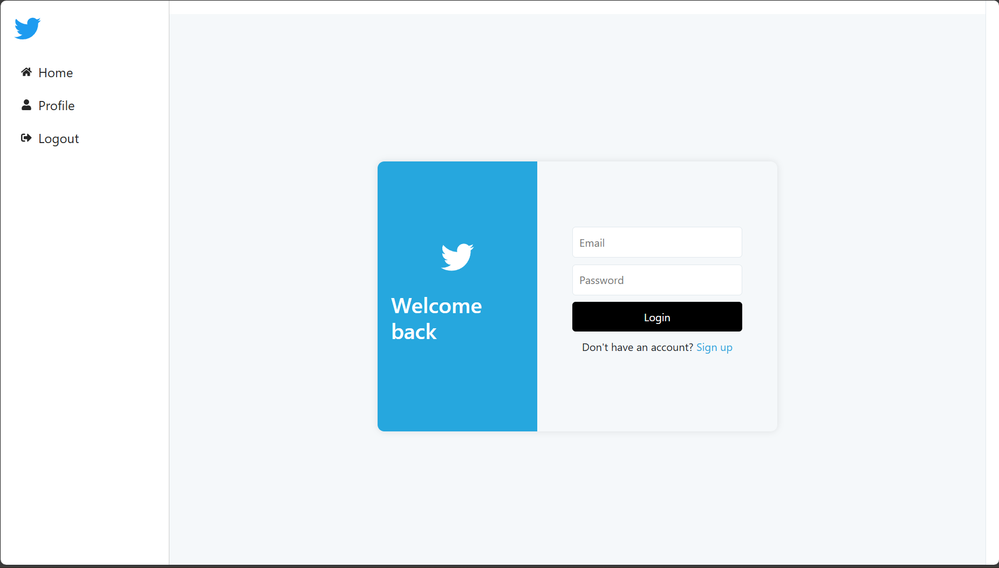
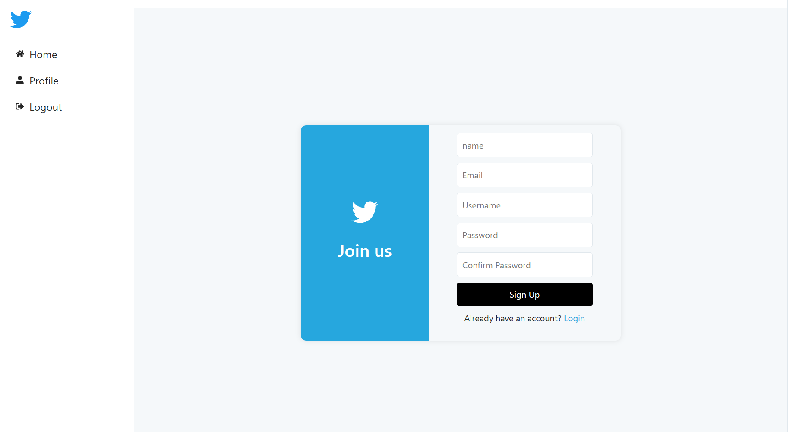
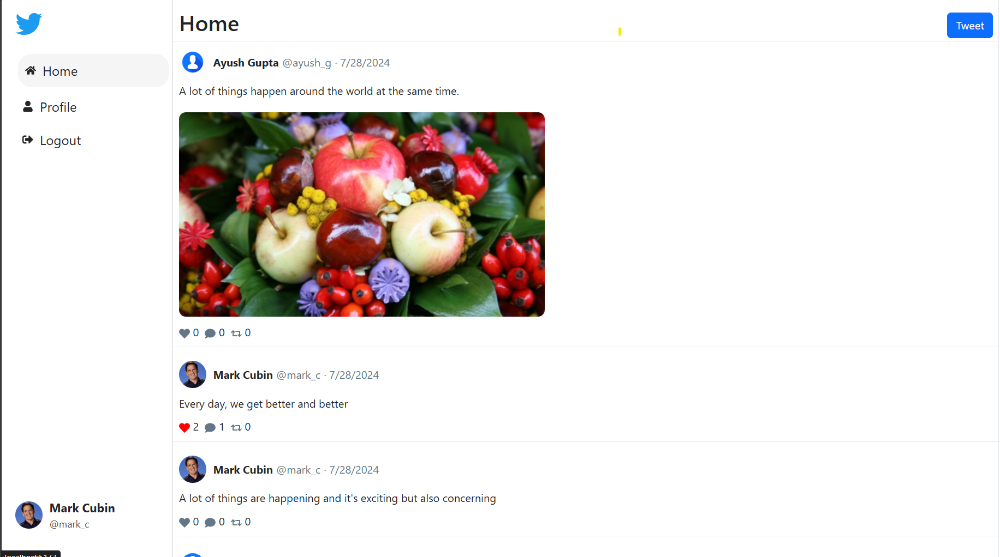
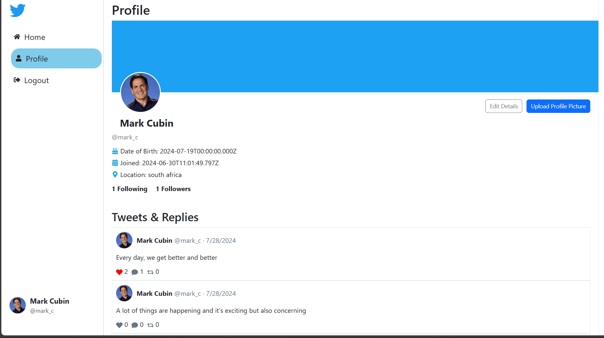
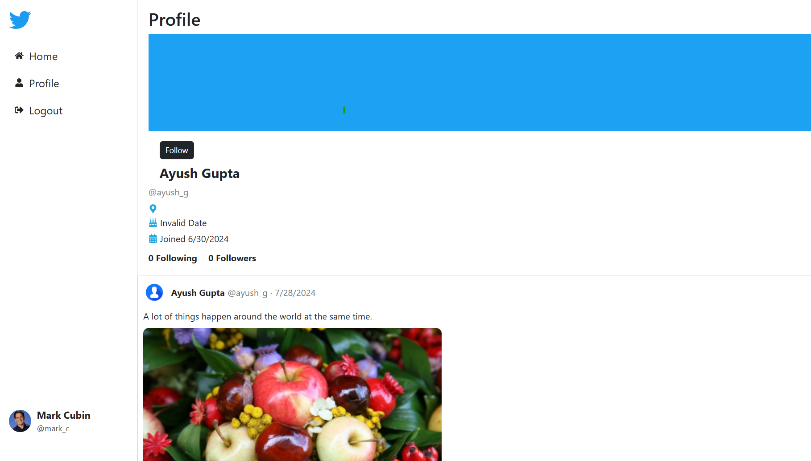

# Twitter Clone Project

## Table of Contents

- [Introduction](#introduction)
- [Features](#features)
- [Screenshots](#screenshots)
- [Installation](#installation)
- [Usage](#usage)
- [Backend](#backend)
- [Frontend](#frontend)

## Introduction

This project is a clone of Twitter, developed using MERN stack(MongoDb, Express.js, React.js, Node.js) . It includes features like user authentication, tweeting, following users, liking, and retweeting tweets. The project is divided into Client and Server which manages frontend (using react, sass and js) and backend (using express.js and node.js, and MongoDB as database) respectively.

## Features

### User Authentication

- **Registration**: Users can create a new account by providing their details.
- **Login**: Existing users can log in with their email and password.
- **Logout**: Users can securely log out of their accounts.

### Home Page

- **Tweet Feed**: Displays a feed of tweets from followed users.
- **Tweet Actions**: Users can like, retweet, and reply to tweets.
- **Compose Tweet**: Users can create and post new tweets.

### Sidebar

- **Navigation**: Quick links to Home, Explore, Notifications, and Profile pages.
- **User Profile**: Displays the logged-in user's profile picture and name at the bottom.

### Profile Page

- **User Information**: Displays user details including name, username, bio, and location.
- **User Tweets**: Shows the tweets and replies by the user.
- **Edit Profile**: Users can update their profile information and upload a profile picture.

### Backend

- **User Management**: Handles user registration, login, profile update, and retrieval.
- **Tweet Management**: Manages creating, liking, retweeting, and replying to tweets.
- **Authentication**: Secures endpoints using JWT authentication.

### Frontend

- **React**: The application is built using React for a responsive and dynamic user experience.
- **Sass**: Styles are managed using Sass for modular and reusable CSS.

## Screenshots

### Login Page



### Registration Page



### Home Page



### Profile Page




## Installation

To run this project locally, follow these steps:

1. **Clone the repository**:
   ```bash
   git clone https://github.com/evirac/twitter-clone.git
   cd twitter-clone
   ```
2. **Install backend dependencies**:
   ```bash
   cd Server
   npm install
   ```
3. **Install frontend dependencies**:

   ```bash
   cd Client
   npm install
   ```

4. **Set up environment variables**:

   - Create a .env file in the backend directory with the following variables:
     .env:

   ```makefile
       MONGO_URI=your_mongodb_uri
       JWT_SECRET=your_jwt_secret
   ```

5. **Run the frontend**:

   ```bash
   cd Client
   npm run dev
   ```

6. **Run the backend**:
   ```bash
   cd Server
   npm start
   ```

## Backend

The backend is built with Node.js and Express. It includes:

- Routes: API endpoints for user and tweet management.
- Controllers: Logic for handling requests and responses.
- Models: Mongoose schemas for User and Tweet entities.
- Middleware: JWT authentication middleware to protect routes.

## Frontend

The frontend is built with React. It includes:

- Components: Reusable components for various parts of the application.
- Pages: Different pages like Home, Explore, Login, Register, and Profile.
- State Management: Used useState for local state management in React components.
- Styling: Used Sass for custom styles and Bootstrap for responsive design and components.

### Main Components and Pages

- App.jsx: Main application component.
- Home.jsx: Homepage displaying tweets.
- Explore.jsx: Explore page to discover new tweets.
- Login.jsx: Login page for user authentication.
- Register.jsx: Registration page for new users.
- Profile.jsx: User profile page.

### Styling

- Sass: Used for custom styling.
- Bootstrap: Used for responsive design and prebuilt components.
